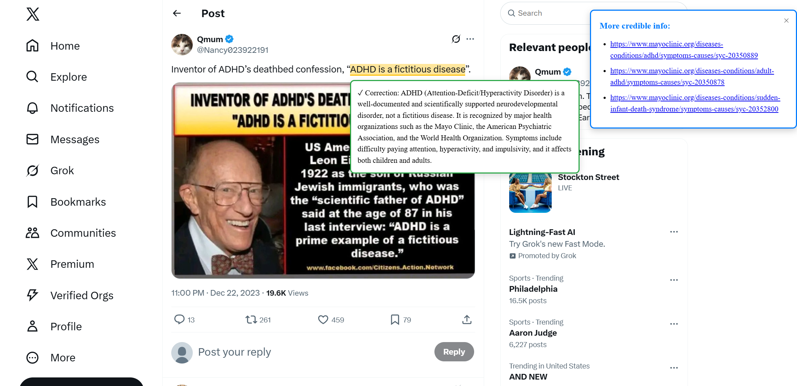
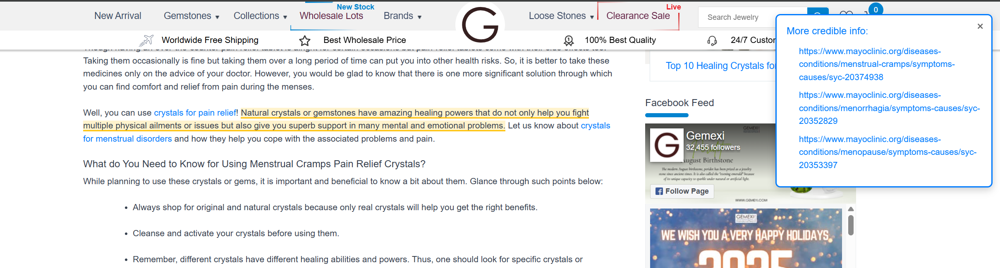

***Simply run this browser extension and it will scan pages for misinformation on initial load***

**RAG-LLM based fact-checking for medically factual browsing**

*Backend:*

Python + FastAPI + Huggingface + Flashrank  
(RAG knowledge base sourced from MayoClinic)  
LLM Model: *Qwen/Qwen3-4B-Instruct-2507*  
Embedding Model: *BAAI/bge-small-en-v1.5*  

*Frontend:*

Javascript Chrome Extension

**Future Plans**
- Currently only runs on page load, which may not capture information populated after loading (e.g. Twitter). We will expand user controls in the future.
- Extend RAG knowledge-base with more documents involving nutrition and other medical conspiracies.
- Support for video websites through transcripts or captions.
- Live updates in response to page updates. 

